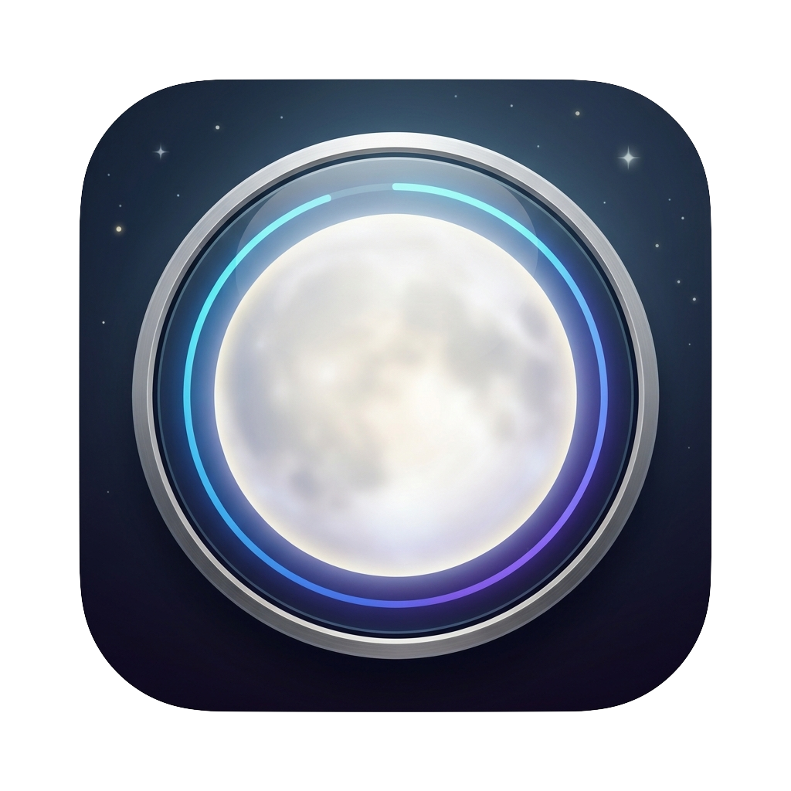
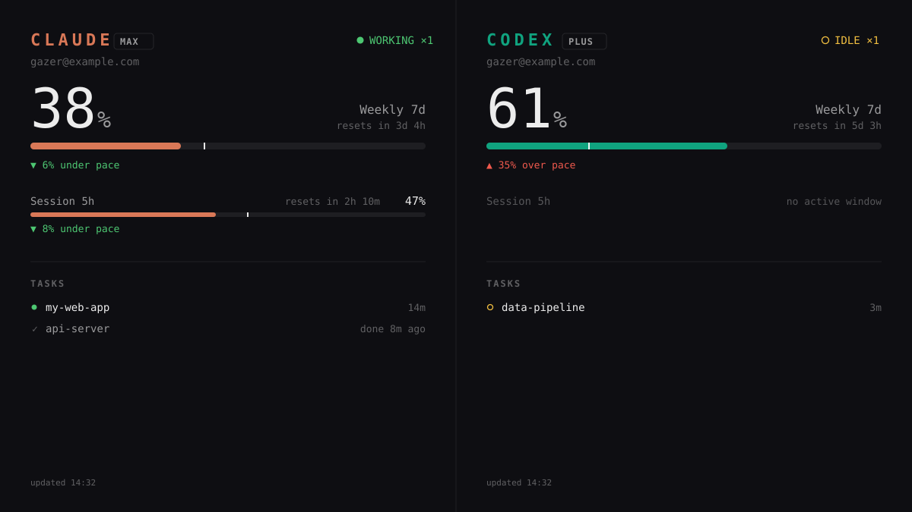

<div align="center">



# Moon Gazer 🌙

**A native macOS dashboard that watches your Claude and Codex usage — side by side, always on.**

Automated AI assistants are like the moon: quietly with you through the night's work.
Moon Gazer is the one who keep an eye on the moon.



*Example with placeholder data. Claude and Codex quota %, reset countdowns, a time-pace
marker and live/finished task status — plus an optional third **OMLX** pane showing the
GPU/memory of another machine on your LAN (e.g. one running a local model).*

</div>

---

## What it shows

Two panes, one per provider. Each shows:

- **Plan + account** (e.g. Max / Plus)
- **Session (5h) window** — a big hero number + reset countdown
- **Weekly (7d) window**, plus any per-model windows
- **Extra usage / credits** when present
- **Pace marker** — a tick on each bar at the fraction of the window's *time* that has
  elapsed. Bar past the tick = burning faster than the clock (`▲ n% over pace`); short of
  it = you have headroom (`▼ n% under pace`).
- **TASKS** — running (●), idle (○) and recently-finished (✓) Claude Code / Codex CLI
  sessions, with an overall status light in the header.
- last-updated time, marked *stale* if a fetch has been failing.

Built for an always-on secondary display: monospaced, dark, Apple-flavoured, 16:9.

An **optional third pane, OMLX**, shows the **GPU and memory usage of another machine on
your LAN** — handy when a second box is running a local model. It appears only when you
configure it (see below); without it the app stays a clean two-pane Claude/Codex view.

## Zero-auth: it reuses sign-ins already on your Mac

There is **nothing to log into**. Moon Gazer reads the credentials the official CLIs/apps
already stored on your machine and calls the same endpoints they do.

| Provider | Credential source (in priority order) | Usage endpoint |
|---|---|---|
| **Claude** | `~/.claude/.credentials.json` → Keychain `Claude Code-credentials` (via `/usr/bin/security`) → Claude Desktop encrypted config (**read-only**) → `CLAUDE_CODE_OAUTH_TOKEN` | `GET api.anthropic.com/api/oauth/usage` |
| **Codex** | `~/.codex/auth.json` (written by `codex login`) | `GET chatgpt.com/backend-api/wham/usage` |

Tasks come from scanning running `claude` / `codex` processes and their recent transcript
files (`~/.claude/projects`, `~/.codex/sessions`). Usage refreshes every 5 min; the task
scan every 5 s. On a failed fetch the last good data stays on screen, marked stale.

> **About the Codex 5-hour window:** OpenAI only returns a 5h window while it's actively
> being metered. When idle, the API returns just the weekly window, so Moon Gazer shows
> a faint `Session 5h — no active window` placeholder until it reappears. This is a
> property of the API, not the app.

## ⚠️ Disclaimer — please read

- **Not affiliated with, endorsed by, or connected to Anthropic or OpenAI** in any way.
  "Claude", "Codex", "ChatGPT" and related marks belong to their respective owners.
- Moon Gazer talks to **private, undocumented endpoints** — the same ones the official
  Claude Code and Codex CLIs use. **These can change or stop working at any time**, and
  their use may be subject to each provider's Terms of Service. **You are responsible for
  ensuring your use complies with those terms.**
- It **only reads credentials already present on your Mac** and sends requests **only** to
  the official Anthropic / OpenAI hosts. **No third-party servers, no telemetry, no
  analytics, no data collection.** Your tokens never leave your machine except in the
  Authorization header to the provider's own API.
- The Claude Desktop fallback is **strictly read-only** — it never refreshes or rewrites
  Claude Desktop's token, so it cannot log you out of Claude Desktop.
- Provided **"as is", without warranty of any kind** (see [LICENSE](LICENSE)).
  **Use at your own risk.**

## Privacy & security

- **Not sandboxed** — it needs to read `~/.claude` and `~/.codex`. Fine for personal use;
  inspect the source (it's small) before you trust it.
- Claude tokens obtained from the CLI/keychain are refreshed via Anthropic's official
  OAuth token endpoint and written back to their original source only.
- The whole data layer is a few hundred lines of Foundation `URLSession` + `JSONSerialization`
  with no third-party dependencies. Read `Sources/MoonGazer/ClaudeService.swift`,
  `CodexService.swift`, and `ClaudeElectronToken.swift` to see exactly what it does.

## Install & run

Requires **macOS 14+** and a Swift toolchain (Xcode or the Swift command-line tools).

```bash
git clone https://github.com/<you>/moon-gazer.git
cd moon-gazer
./build-app.sh          # produces Moon Gazer.app (ad-hoc signed)
open "Moon Gazer.app"
```

Or run straight from source:

```bash
swift run -c release MoonGazer
```

Headless sanity check (prints both panes as text and exits — good for debugging auth):

```bash
swift run -c release MoonGazer --probe
```

Gatekeeper may warn on first open of an ad-hoc-signed app — right-click the app → **Open**.

### App icon

Drop a square PNG named `icon.png` in the repo root before running `./build-app.sh` and it
becomes the app icon automatically (via `sips` + `iconutil`).

## Using it

- **Full screen:** hit the green traffic-light button (or **⌃⌘F**). macOS gives it its own
  Space, so it sits beside your desktop and never fights that display's menu bar.
- On launch it centers on a dedicated **960×540-point** screen if one is connected (e.g. a
  small 1920×1080 panel at 2×), else the smallest secondary screen, else the main screen.
- The content scales to fill the window, keeping aspect ratio.

## Customization (Settings — ⌘,)

Open **Settings** from the app menu (or ⌘,). Everything persists to
`~/.config/moongazer/settings.json`.

- **Templates** — five modern looks to start from: *Terminal* (the default — monospaced,
  near-black), *Material*, *Cupertino*, *Editorial* (serif), and *Luxe*. Pick one, then
  tweak anything below; your changes stick.
- **Appearance** — Light, Dark, or Follow System.
- **Typography** — separate fonts for **body text** and the **big numbers**, each with its
  own bold toggle. Choose from SF Mono, Menlo (mono), New York, Charter (serif), SF Pro, SF
  Rounded, Helvetica Neue, Avenir Next (sans) — all system fonts, nothing bundled.
- **Colors** — set the **accent per pane** (Claude / Codex / OMLX), the **warning** and
  **danger** colours, and the **thresholds** they kick in at. Pick from 32 curated presets
  (≈16 tuned for dark backgrounds, ≈16 for light, brand colours included) or type any hex /
  use the native colour wheel. Bar behaviour has three modes — *accent, alert at high %*,
  *accent → warn → danger*, or *accent only* (which greys out the alert colours since they
  no longer apply).
- **Layout** — choose which columns show and their left-to-right order; hide any you don't
  need (OMLX appears once configured).

## Recommended display

Moon Gazer is happiest on a small, always-on secondary screen parked beside your main
display. The layout is tuned for a **960×540-point** canvas — i.e. a **1920×1080 panel at
2× scaling**, which is what a compact 7-inch monitor gives you.

A good fit is a small portable 1080p touchscreen such as the
[PeakDo 7" Portable Monitor](https://www.amazon.com/PeakDo-Portable-Monitor-Touchscreen-Lightweight/dp/B0DF1P542S)
(1920×1080, set macOS display scaling so it renders as 960×540 points). Any 1920×1080
secondary display works — this is just the size the design targets. Set that display's
scaling to “looks like 960×540”, drop Moon Gazer on it, and press the green button for
full screen.

*(Not affiliated with or sponsored by PeakDo or Amazon — just a hardware suggestion.)*

## OMLX pane — watching a remote machine's GPU/MEM

The third pane monitors another machine (e.g. one serving a local model) via a tiny,
dependency-free agent you run on that machine. It reads GPU utilization from `ioreg`
(Apple Silicon, no sudo) and memory from `vm_stat`, and serves them as JSON.

**1. On the machine you want to watch**, copy and run the agent:

```bash
scp agent/omlx-agent.py you@<remote-host>:~/
ssh you@<remote-host> 'python3 ~/omlx-agent.py --port 8082'
```

It prints `omlx-agent serving on http://0.0.0.0:8082/metrics`. (To keep it running after
you log out, launch it under `tmux`/`nohup`, or wrap it in a `launchd` plist.)

**2. On the machine running Moon Gazer**, point the app at it via a small config file:

```bash
mkdir -p ~/.config/moongazer
echo '{"omlxUrl": "http://<remote-host>:8082/metrics", "omlxLabel": "my-model-box"}' \
  > ~/.config/moongazer/config.json
```

`omlxLabel` is optional — a friendly name shown in the pane header instead of the host's
raw system hostname (which macOS can munge into something ugly). You can also set
`MOONGAZER_OMLX_URL` / `MOONGAZER_OMLX_LABEL` in the launch environment instead of the file.

Restart Moon Gazer and the OMLX pane appears: GPU% as the hero, memory as the second bar,
with an ONLINE/OFFLINE indicator. If a local model server is running on that host, the
agent also reports the **currently loaded model** (auto-detected from Ollama, LM Studio,
or any OpenAI-compatible `/v1/models` endpoint such as llama.cpp / `mlx_lm.server`). The
agent is polled every few seconds. GPU% requires Apple Silicon; memory works on any macOS.
The agent serves only these numbers, to your LAN, and nothing else — read
`agent/omlx-agent.py` (about 180 lines) to confirm.

### Tokens/sec from oMLX

If the host runs [oMLX](https://github.com/jundot/omlx) (an Apple-Silicon MLX inference
server), the agent also reports **prompt-processing (PP)** and **text-generation (TG)**
throughput in tok/s, read from oMLX's `/admin/api/stats`. By default the agent looks for
oMLX at `http://localhost:8000`; override with `--omlx-base`. If your oMLX requires admin
auth (i.e. it does *not* have "skip API key verification" enabled), pass its key:

```bash
python3 omlx-agent.py --port 8082 --omlx-base http://localhost:8000 --omlx-key <your-oMLX-key>
```

PP/TG are session averages; they read `idle` until requests have run. Other servers don't
expose a live throughput endpoint, so tok/s is oMLX-only for now.

## For AI coding assistants (porting this to another Mac)

If an assistant is setting this up on someone else's machine, this is all it needs:

1. **Prerequisites:** macOS 14+, Swift toolchain. App is non-sandboxed by design.
2. **Claude data** appears once the user has signed into **Claude Code** (`claude`, token
   in Keychain `Claude Code-credentials` or `~/.claude/.credentials.json`) *or* has
   **Claude Desktop** signed in (read-only fallback). No app-specific login exists.
3. **Codex data** appears once the user has run **`codex login`** (`~/.codex/auth.json`).
4. **Build & verify:** `./build-app.sh` then run `swift run -c release MoonGazer --probe`
   to confirm both providers resolve before launching the GUI.
5. No secrets are committed to this repo and none should be. Everything is read live from
   the machine's own credential stores at runtime.

## Credits

Moon Gazer stands on a lot of prior art in the Claude/Codex usage-tracker community. The
data-fetching techniques were learned from several excellent open-source projects — see
[ACKNOWLEDGEMENTS.md](ACKNOWLEDGEMENTS.md) for full credits and links. Thank you to all of
their authors.

Built with [Claude Code](https://claude.com/claude-code) (Claude Opus).

## License

[MIT](LICENSE) — do what you like, no warranty.
